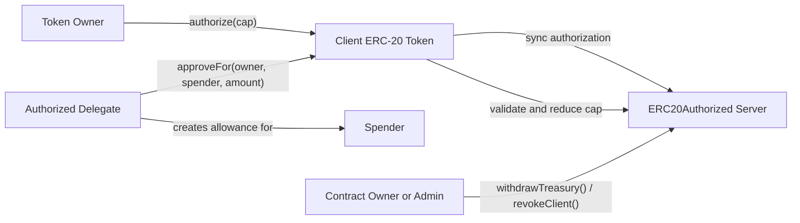
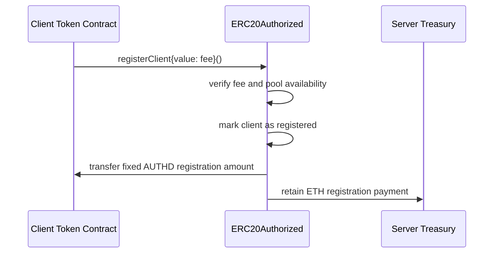
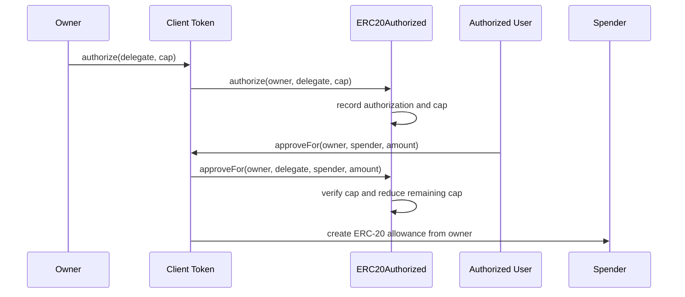
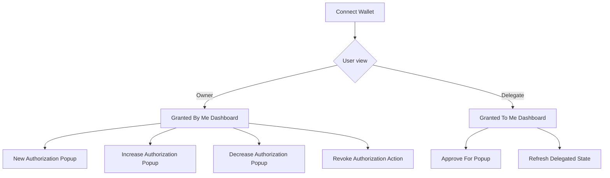

# Authorization-AUTHD

## 1. Executive Summary

**Authorization-AUTHD** extends the ERC-20 approval model so that a token holder can authorize a secondary address to approve spenders **on the holder's behalf**, but only up to a defined **cap**. The system separates concerns into:

- an **authorization server** that stores delegation state, client registration status, and treasury logic
- a **client token wrapper** that syncs ERC-20 allowances with the server-side authorization records
- a **demo/test client** used to validate the delegated approval workflow end to end

This design addresses a common limitation of standard ERC-20 tokens: only the token owner can call `approve`. In this project, the owner can delegate a bounded approval budget to an authorized operator, who can then allocate part of that budget to third-party spenders without receiving full custody of the owner's tokens.

---

## 2. Project Objective

The goal of this project is to implement a reusable authorization layer for ERC-20 tokens that supports:

1. **client registration**
2. **bounded delegation**
3. **delegated approvals**
4. **cap updates and revocation**
5. **automatic cap adjustment after token transfers**
6. **basic registration economics through the AUTHD token and treasury**

This repository contains the on-chain prototype, unit tests, and deployment scaffolding required to demonstrate the concept in a way that is aligned with the course deliverables.

---

## 3. High-Level Architecture



### Architecture in plain language

- The **owner** interacts with a **client token**.
- The client token forwards delegation metadata to the **authorization server**.
- The **authorized delegate** can later allocate part of the delegated budget to a **spender**.
- The server ensures the delegate cannot exceed the approved cap.
- The client token keeps ERC-20 allowances synchronized with the server-side state.

---

## 4. Core Contracts

| Contract | Type | Purpose | Key Responsibility |
|---|---|---|---|
| `contracts/ERC20Authorized.sol` | Main contract | Authorization server and AUTHD token | Registers client contracts, stores delegation state, manages caps, emits events, and handles treasury logic |
| `contracts/ERC20AuthorizedClient.sol` | Abstract client wrapper | Client-side integration layer | Lets an ERC-20 token opt into authorization features and keeps allowances synchronized with server state |
| `contracts/interfaces/IERC20Authorized.sol` | Interface | Shared interface/events | Defines events and functions used by the server and client wrapper |
| `contracts/ERC20AuthorizedErrors.sol` | Error library | Custom errors | Centralizes revert reasons for readability and lower gas vs long strings |
| `contracts/CustomClient.sol` | Example concrete client | Demo/testnet-ready client stub | Shows how a real ERC-20 token can inherit the authorization client wrapper |
| `test/DemoClient.sol` | Test helper contract | Test-only demo client | Used by Solidity unit tests to validate client-wrapper behavior |

---

## 5. Contract Interaction Model

### 5.1 Registration flow



### 5.2 Delegated approval flow



---

## 6. On-Chain Design Details

### 6.1 AUTHD token economics and client registration

The authorization server mints an internal **AUTHD** token supply and reserves part of that supply for onboarding client contracts.

| Parameter | Value | Meaning |
|---|---:|---|
| Initial AUTHD supply | `1,000,000` | Total AUTHD minted at deployment |
| Client registration reserve | `250,000` | Portion reserved for registering client contracts |
| Fixed AUTHD sent per registration | `20` | AUTHD granted to each successfully registered client |
| Minimum registration fee | `0.01 ETH` | Floor fee paid by a client to register |

### Dynamic pricing model

The server implements a **piecewise linear pricing function** for AUTHD based on how many reserved client-pool tokens remain.

| Tier | Remaining AUTHD in client pool | Price range per AUTHD |
|---|---|---|
| Tier 1 | `250,000 -> 200,000` | `0.00002 ETH -> 0.0004 ETH` |
| Tier 2 | `200,000 -> 50,000` | `0.0004 ETH -> 0.002 ETH` |
| Tier 3 | `50,000 -> 0` | `0.002 ETH -> 0.01 ETH` |

This makes client registration a capped onboarding mechanism rather than a free infinite registry.

---

### 6.2 Authorization state model

The server stores authorization data **per client contract**, so the same user can have different delegated approval relationships across different token contracts.

### Main stored relationships

| State | Description |
|---|---|
| `isRegisteredClient[client]` | Whether a client token contract is allowed to use the authorization server |
| `authorizationInfo[authorized]` | Stores the delegated cap and authorization status for an owner-authorized pair |
| `authorizers` | List of addresses currently authorized by an owner for a given client |
| `delegatedBy[authorized]` | Reverse lookup showing which owners have delegated to a specific authorized address |

This design supports both direct lookups and list-based UI queries.

---

### 6.3 Cap lifecycle

| Action | Effect on cap |
|---|---|
| `authorize(...)` | Creates a new authorization entry and sets the initial cap |
| `increaseAuthorizedCap(...)` | Raises the cap while checking owner balance constraints |
| `decreaseAuthorizedCap(...)` | Reduces the cap, clipping to zero if subtraction exceeds current cap |
| `approveFor(...)` | Consumes part of the cap when the delegate approves a spender |
| `revokeAuthorization(...)` | Removes the authorization entry and list references entirely |
| `_update(...)` in client | Automatically reduces caps if owner balance drops below an outstanding cap |

---

## 7. Main User Flows

### 7.1 Registering a client token

1. A token contract that integrates `ERC20AuthorizedClient` calls `registerClient()`
2. The server checks:
   - client is not already registered
   - registration fee is high enough
   - client pool still has AUTHD available
3. The server records the client as registered
4. The server transfers a fixed amount of AUTHD to the client
5. ETH stays in the server treasury

### 7.2 Owner authorizes a delegate

1. The token owner calls `authorize(delegate, cap)` on the client token
2. The client token:
   - sets a normal ERC-20 allowance for the delegate
   - forwards the authorization request to the server
3. The server checks:
   - client is registered
   - addresses are valid
   - delegate is not the owner
   - owner balance is large enough for the proposed cap
4. The cap is recorded and events are emitted

### 7.3 Delegate approves a spender on behalf of owner

1. An authorized user calls `approveFor(owner, spender, amount)`
2. The client wrapper reads the delegate's remaining cap
3. The client wrapper updates allowances:
   - reduces the delegate's remaining allowance
   - grants allowance to the target spender
4. The server validates the request and reduces the server-side cap
5. The approval amount is now bounded by the delegated budget instead of unlimited trust

### 7.4 Owner or system reduces/revokes delegation

Delegation can be reduced in three ways:

- manual cap decrease
- full revocation
- automatic cap reconciliation when token transfers reduce owner balance

This is important because it prevents stale approval budgets from exceeding the owner's current token holdings.

---

## 8. Security and Validation Considerations

| Control | Why it matters |
|---|---|
| Registered-client gate | Prevents arbitrary contracts from writing authorization state |
| Zero-address validation | Avoids broken authorization records and invalid approvals |
| Self-authorization prohibition | Prevents meaningless or suspicious self-delegation |
| Owner-balance checks on authorization/increase | Prevents over-delegating beyond current holdings at creation time |
| Invalid spender checks | Prevents delegating approvals back to the owner or authorized operator in `approveFor` |
| Custom errors | Makes failure cases explicit and cheaper than long revert strings |
| Owner-only treasury withdrawal | Restricts treasury access |
| Owner-only client revocation | Allows administrative shutdown of misbehaving client contracts |
| Per-client namespacing | Prevents authorization state from one token contract leaking into another |
| Automatic cap adjustment in `_update` | Helps keep delegated budget aligned with changing token balances |

---

## 9. Event Model

The interface exposes a clear event set that is useful for testing, indexing, and UI integration.

| Event | Purpose |
|---|---|
| `ClientRegistered` | Signals successful onboarding of a client token contract |
| `ClientRegistrationRevoked` | Signals administrative revocation of a client |
| `TreasuryWithdrawal` | Signals movement of registration ETH out of treasury |
| `Authorization` | Signals creation of a delegated approval relationship |
| `RevokeAuthorization` | Signals removal of a delegated approval relationship |
| `IncreaseAuthorizedCap` | Signals cap increase |
| `DecreaseAuthorizedCap` | Signals cap decrease |
| `ApproveFor` | Signals a delegate-approved spender allocation |

---

## 10. Repository Structure

```text
Authorization-AUTHD/
├─ contracts/
│  ├─ interfaces/
│  │  └─ IERC20Authorized.sol
│  ├─ lib/
│  │  └─ AddressArrayUtils.sol
│  ├─ CustomClient.sol
│  ├─ ERC20Authorized.sol
│  ├─ ERC20AuthorizedClient.sol
│  └─ ERC20AuthorizedErrors.sol
├─ scripts/
│  └─ ERC20Authorized_deploy.ts
├─ test/
│  ├─ Authorized_integration.ts
│  ├─ DemoClient.sol
│  ├─ ERC20Authorized.t.sol
│  └─ ERC20AuthorizedClient.t.sol
├─ frontend/
│  └─ .gitkeep
├─ hardhat.config.ts
└─ package.json
```

---

## 11. Testing Strategy

The repository uses **Solidity-based unit tests** for the core logic. The test suite is split by responsibility:

| Test file | Focus |
|---|---|
| `test/ERC20Authorized.t.sol` | Server-side authorization, registration, cap logic, treasury behavior |
| `test/ERC20AuthorizedClient.t.sol` | Client-wrapper synchronization with ERC-20 allowances and delegated approval flows |
| `test/Authorized_integration.ts` | Placeholder for future TypeScript integration testing |

### 11.1 What the server tests validate

| Category | Examples covered |
|---|---|
| Address and authorization constraints | invalid addresses, self-authorization, duplicate authorization |
| Balance constraints | authorizing or increasing beyond owner balance |
| Cap behavior | normal updates, overflow clipping, underflow clipping |
| List maintenance | `getAuthorizersList` and `getOwnersList` stay correct after revocation |
| Approval constraints | invalid spender, zero-amount approval, amount greater than cap |
| Registration | successful registration, insufficient fee, duplicate registration, registered-client checks |
| Treasury | successful withdrawal, non-owner rejection, empty-balance rejection |
| Client isolation | authorizations are namespaced by client contract |

### 11.2 What the client tests validate

| Category | Examples covered |
|---|---|
| Client registration | wrapper can register against the server |
| Authorization synchronization | `authorize` emits both ERC-20 `Approval` and server `Authorization` events |
| Cap synchronization | increase/decrease operations keep client allowance and server cap aligned |
| Revocation | authorization removal clears delegated allowance and blocks future delegated actions |
| Delegated approval | `approveFor` updates both spend allowances and remaining cap |
| Batched approvals | `approveForMultiple` validates array inputs and updates multiple spenders |
| Post-transfer reconciliation | `_update` reduces caps when owner balance falls below previously authorized amounts |

---

## 12. Setup and Build Instructions

### 12.1 Prerequisites

- Node.js
- npm
- Hardhat
- Foundry/Forge for running Solidity `.t.sol` tests
- Sepolia RPC credentials for deployment

### 12.2 Install dependencies

```bash
npm install
```

### 12.3 Compile contracts

```bash
npx hardhat compile
```

### 12.4 Environment variables for deployment

Create environment variables for:

```bash
SEPOLIA_RPC_URL=...
SEPOLIA_PRIVATE_KEY=...
ETHERSCAN_API_KEY=...
```

### 12.5 Deploy to Sepolia

```bash
npx hardhat run scripts/ERC20Authorized_deploy.ts --network sepolia
```

### 12.6 Run tests

The repository's main tests are Solidity `.t.sol` tests, so the intended local workflow is:

```bash
forge test -vv
```

> **Note:** The current repository snapshot includes a Hardhat config and a Sepolia deployment script, but it does **not** include package scripts or a `foundry.toml` file. If your local course setup already provides remappings/tooling, keep using that setup. Otherwise, add the small amount of Foundry configuration needed for your environment before running the Solidity tests.

---

## 13. Deployment Notes

The included deployment script is explicitly **Sepolia-only**. It connects through Hardhat's viem tooling and deploys `ERC20Authorized` using the configured wallet client.

### Current implementation note for `CustomClient`

`contracts/CustomClient.sol` is a demo client contract with a placeholder authorization-server address and a debug `buyTokens` helper. Before real testnet use, the `_authorizationServerAddr` constant must be updated to the deployed server address.

---

## 14. Wireframe Interpretation Guide

The repository includes wireframe screenshots in `assets/` generated from the frontend scaffold. These screenshots are used to demonstrate the intended dApp flow and as a result, make the user journey easy to evaluate.

### 14.1 Wireframe gallery

<table>
  <tr>
    <td align="center" width="50%">
      
      <br />
      <sub><b>Home — Granted By Me</b><br />Owner-facing dashboard for managing delegate authorizations</sub>
    </td>
    <td align="center" width="50%">
      
      <br />
      <sub><b>Home — Granted To Me</b><br />Delegate-facing dashboard for viewing authorizations granted to the connected wallet</sub>
    </td>
  </tr>
  <tr>
    <td align="center" width="50%">
      
      <br />
      <sub><b>New Authorization</b><br />Create a capped authorization for a delegate wallet</sub>
    </td>
    <td align="center" width="50%">
      
      <br />
      <sub><b>Increase Authorization</b><br />Expand an existing delegated cap</sub>
    </td>
  </tr>
  <tr>
    <td align="center" width="50%">
      
      <br />
      <sub><b>Decrease Authorization</b><br />Reduce an existing delegated cap</sub>
    </td>
    <td align="center" width="50%">
      
      <br />
      <sub><b>Approve For</b><br />Delegate-side popup for submitting <code>approveFor(owner, spender, amount)</code></sub>
    </td>
  </tr>
</table>

### 14.2 Interpreting the wireframe

The wireframe is intentionally minimal and focused on the core features promised by the project:

- **Wallet connection** serves as the entry point to the dApp.
- **Granted By Me** represents the token-owner workflow.
- **Granted To Me** represents the delegate workflow.
- **Popup actions** expose the major contract interactions in a way that is easy to capture in screenshots and easy for graders to interpret.

Together, the screenshots show the primary delegated-authorization lifecycle:

1. the user connects a wallet
2. the token owner creates a capped authorization for a delegate
3. the owner can increase, decrease, or revoke that authorization
4. the delegate can view delegated capacity and execute `approveFor`

### 14.3 Wireframe user journey



### 14.4 Screenshot-to-feature mapping

| Feature | Wireframe evidence |
|---|---|
| Wallet connection | visible from the dashboard entry state and wallet control in the scaffold |
| Owner dashboard | `assets/home-granted-by-me.png` |
| Delegate dashboard | `assets/home-granted-to-me.png` |
| Create authorization flow | `assets/new-authorization.png` |
| Increase/decrease cap flow | `assets/increase-authorization.png`, `assets/decrease-authorization.png` |
| Delegated approval flow | `assets/approve-for.png` |

---

## 15. Test Execution Evidence

The repository also includes screenshots of successful test execution output in `assets/`.

<table>
  <tr>
    <td align="center" width="50%">
      
      <br />
      <sub><b>Test Output 1</b><br />Representative output from one of the Solidity test files</sub>
    </td>
    <td align="center" width="50%">
      
      <br />
      <sub><b>Test Output 2</b><br />Representative output from another Solidity test file</sub>
    </td>
  </tr>
</table>

These screenshots are included as evidence that the project's test suite was executed successfully and that the core authorization flows and failure cases were validated during development.

---

## 16. Conclusion

Authorization-AUTHD demonstrates a coherent delegated-approval extension for ERC-20 tokens. The system is organized around a reusable authorization server, a client wrapper that preserves standard ERC-20 behavior while enabling bounded delegation, and a test suite that validates both functional and failure paths.

The submission is strengthened by the inclusion of wireframe screenshots and test-output evidence, which make both the intended user flow and the validation process explicit. Together, the contracts, tests, and UI wireframe present a complete prototype that is easy to map back to the project rationale.

---
