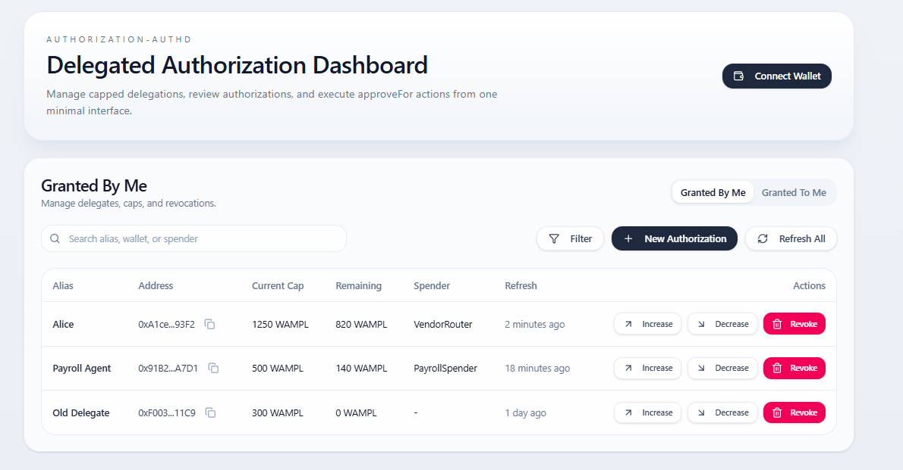
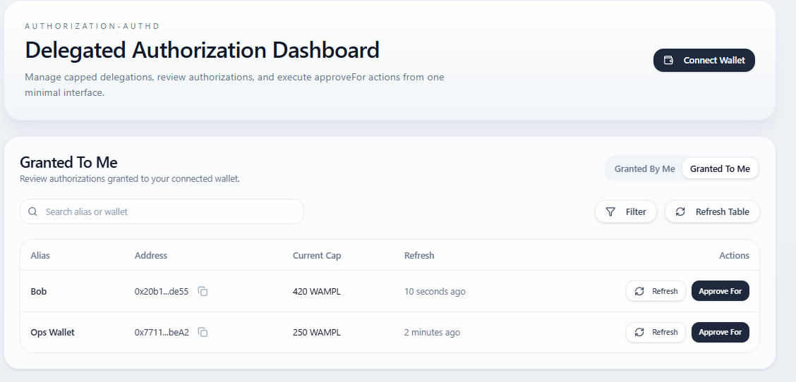
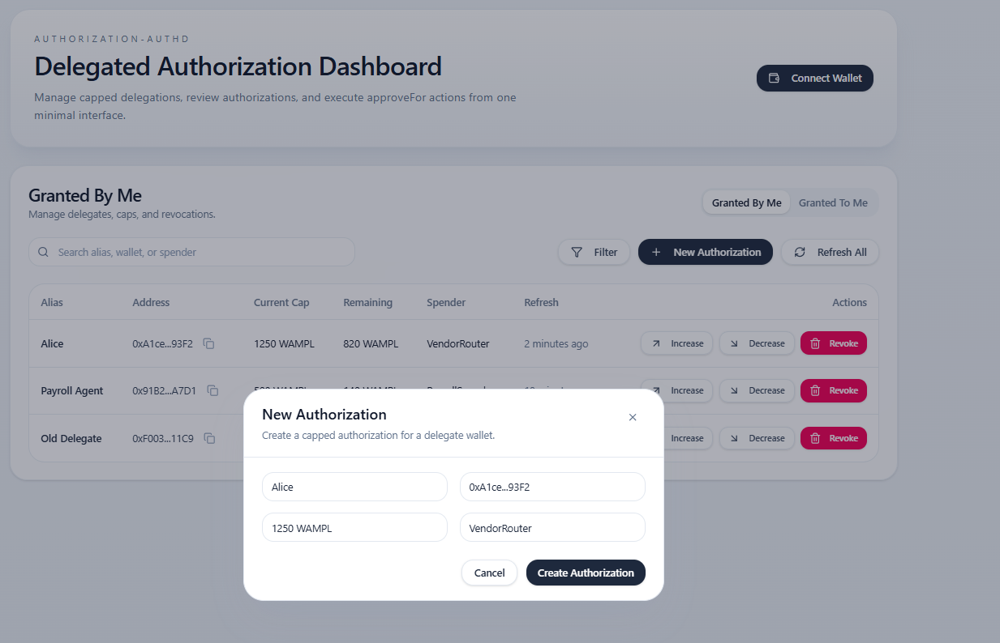
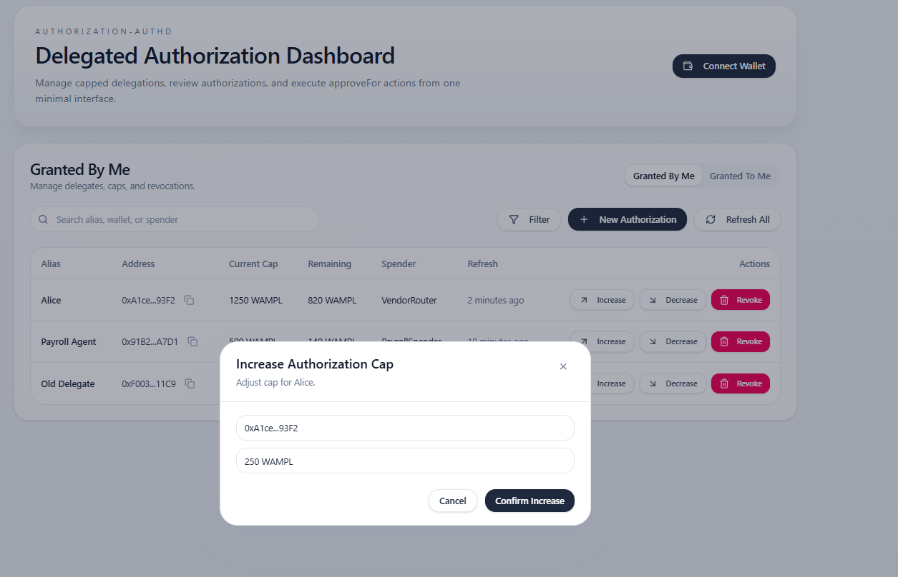
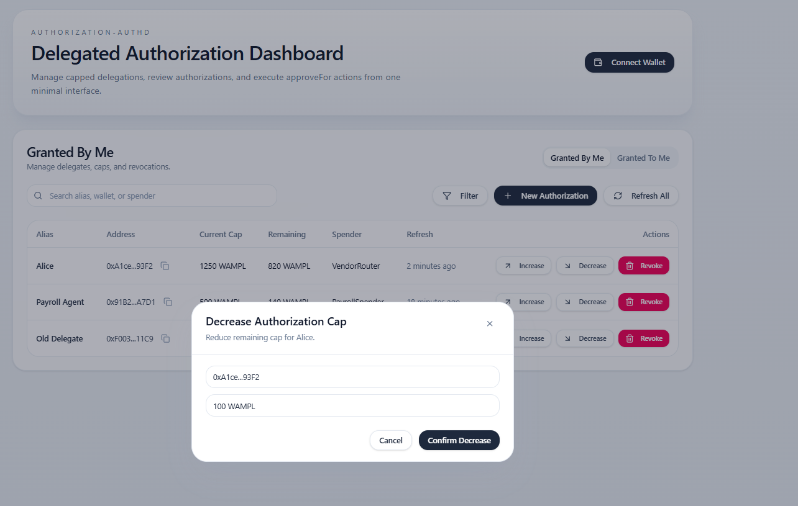
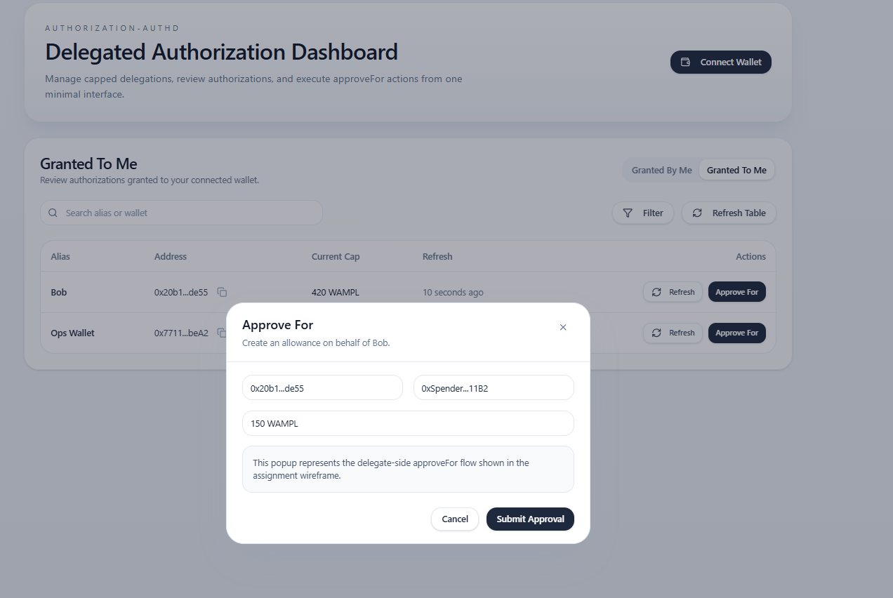
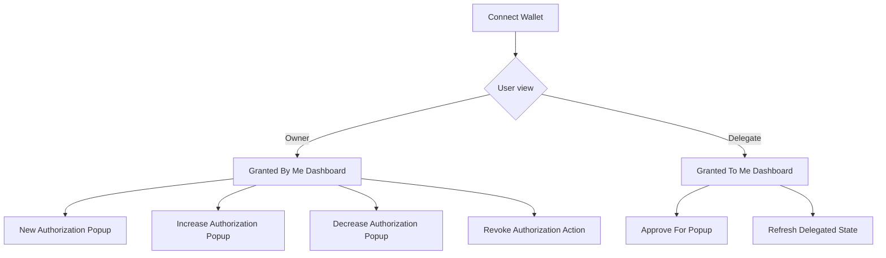
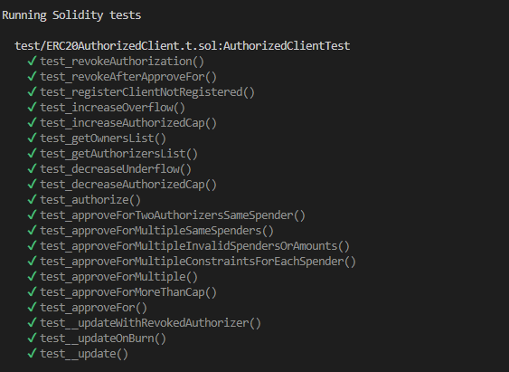
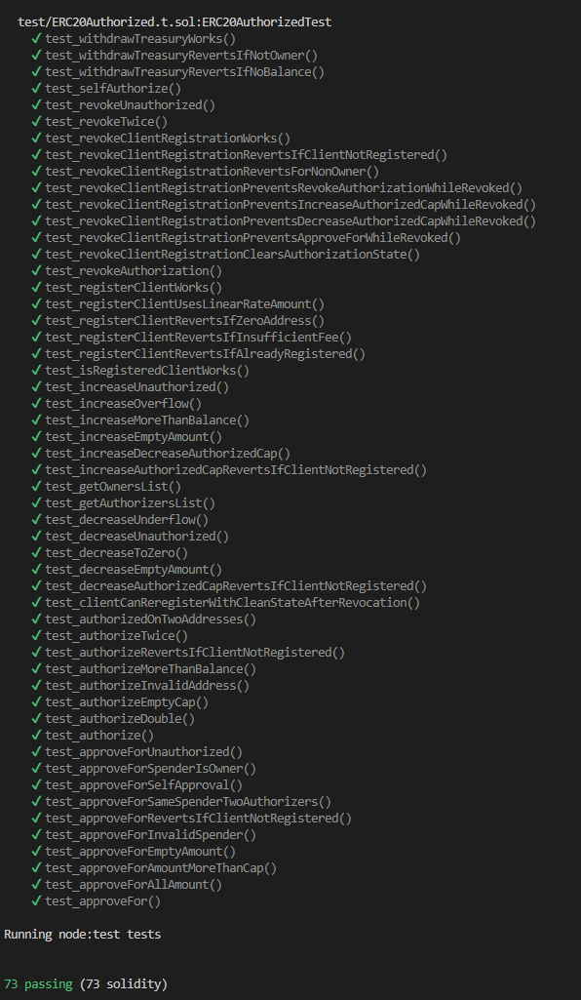

## 14. Wireframe Interpretation Guide

The repository includes wireframe screenshots in `assets/` generated from the frontend scaffold. These screenshots are used to demonstrate the intended dApp flow for the Assignment 3 submission and make the user journey easy to evaluate.

### 14.1 Wireframe gallery

<table>
  <tr>
    <td align="center" width="50%">
      
       
      <b>Home — Granted By Me</b> Owner-facing dashboard for managing delegate authorizations
    </td>
    <td align="center" width="50%">
      
       
      <b>Home — Granted To Me</b> Delegate-facing dashboard for viewing authorizations granted to the connected wallet
    </td>
  </tr>
  <tr>
    <td align="center" width="50%">
      
       
      <b>New Authorization</b> Create a capped authorization for a delegate wallet
    </td>
    <td align="center" width="50%">
      
       
      <b>Increase Authorization</b> Expand an existing delegated cap
    </td>
  </tr>
  <tr>
    <td align="center" width="50%">
      
       
      <b>Decrease Authorization</b> Reduce an existing delegated cap
    </td>
    <td align="center" width="50%">
      
       
      <b>Approve For</b> Delegate-side popup for submitting <code>approveFor(owner, spender, amount)</code>
    </td>
  </tr>
</table>

### 14.2 Interpreting the wireframe

The wireframe is intentionally minimal and focused on the core features promised by the project:

- **Wallet connection** serves as the entry point to the dApp.
- **Granted By Me** represents the token-owner workflow.
- **Granted To Me** represents the delegate workflow.
- **Popup actions** expose the major contract interactions in a way that is easy to capture in screenshots and easy for graders to interpret.

Together, the screenshots show the primary delegated-authorization lifecycle:

1. the user connects a wallet
2. the token owner creates a capped authorization for a delegate
3. the owner can increase, decrease, or revoke that authorization
4. the delegate can view delegated capacity and execute `approveFor`

### 14.3 Wireframe user journey

### 14.4 Screenshot-to-feature mapping

| Feature | Wireframe evidence |
|---|---|
| Wallet connection | visible from the dashboard entry state and wallet control in the scaffold |
| Owner dashboard | `assets/home-granted-by-me.png` |
| Delegate dashboard | `assets/home-granted-to-me.png` |
| Create authorization flow | `assets/new-authorization.png` |
| Increase/decrease cap flow | `assets/increase-authorization.png`, `assets/decrease-authorization.png` |
| Delegated approval flow | `assets/approve-for.png` |

### 14.5 Why this wireframe is sufficient for the assignment

The assignment requires a wireframe showing the major screens and user journey of the dApp. These screenshots satisfy that requirement because they clearly show:

- the main dashboard views
- the separation between owner and delegate workflows
- the forms and actions tied to the core smart contract functions
- the intended user flow through the application

This makes the frontend behavior easy to evaluate against the rubric categories for **dApp Wireframe & User Flow**, **White Paper Alignment**, and **Overall Presentation**.

---

## 15. Test Execution Evidence

To support the unit testing portion of the assignment, the repository also includes screenshots of successful test execution output in `assets/`.

<table>
  <tr>
    <td align="center" width="50%">
      
       
      <b>Test Output 1</b> Representative output from one of the Solidity test files
    </td>
    <td align="center" width="50%">
      
       
      <b>Test Output 2</b> Representative output from another Solidity test file
    </td>
  </tr>
</table>

These screenshots are included as evidence that the project’s test suite was executed successfully and that the core authorization flows and failure cases were validated during development.

---

## 16. Mapping to the Assignment Rubric

| Rubric category | How this repository supports it |
|---|---|
| White Paper Alignment & Design Logic | The architecture clearly expresses a delegated-approval model built around registration, authorization caps, and controlled approval propagation |
| Smart Contract Functionality | Core features are implemented as contracts with defined responsibilities and interaction points |
| Code Quality & Security Considerations | The design includes access control, custom errors, validation checks, and explicit event emission |
| Unit Testing | The Solidity tests cover successful flows, failure cases, event expectations, and edge conditions, and the README includes screenshot evidence of test execution |
| dApp Wireframe & User Flow | The README includes actual wireframe screenshots from the frontend scaffold, showing owner and delegate dashboards plus the key popup flows for authorization management and `approveFor` |
| Overall Presentation & Documentation | The repository structure, setup, system explanation, testing process, wireframe interpretation, and visual evidence are documented in a professional and easy-to-evaluate format |

---

## 17. Assumptions and Current Limitations

| Item | Status |
|---|---|
| TypeScript integration tests | `Authorized_integration.ts` currently appears to be a placeholder |
| Frontend implementation | The included frontend screenshots are wireframe-oriented and primarily intended to demonstrate UI flow rather than a fully integrated production dApp |
| Custom client deployment address | `CustomClient.sol` still has a TODO for the deployed server address |
| Local test tooling | Solidity tests exist, but extra Foundry configuration may still be needed depending on local setup |

These limitations are acceptable for a course prototype as long as they are stated clearly and the core smart-contract logic remains coherent and testable.

---

## 18. Conclusion

Authorization-AUTHD demonstrates a coherent delegated-approval extension for ERC-20 tokens. The system is organized around a reusable authorization server, a client wrapper that preserves standard ERC-20 behavior while enabling bounded delegation, and a test suite that validates both functional and failure paths.

The submission is strengthened by the inclusion of wireframe screenshots and test-output evidence, which make both the intended user flow and the validation process explicit. Together, the contracts, tests, and UI wireframe present a complete prototype that is easy to map back to the project rationale and grading rubric.

From a marking perspective, the strongest parts of this submission are:

- clear contract separation
- explicit authorization state transitions
- event-driven observability
- meaningful negative testing
- a wireframe that directly shows the core owner/delegate flows

---

## 19. Recommended Submission Add-ons

To strengthen the final submission even further, attach:

1. a PDF export that combines the wireframe screenshots into one appendix
2. a screenshot of successful test output
3. deployed Sepolia address for `ERC20Authorized`
4. a screenshot or log of a sample delegated approval transaction
